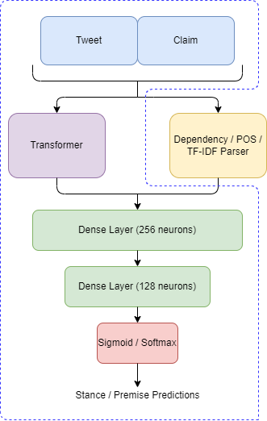

# [Team enolp musk@SMM4H’22 : Leveraging Pre-trained Language Models for Stance And Premise Classification](https://aclanthology.org/2022.smm4h-1.42/)
This repository contains our approaches on the Shared Task "Classification of Stance & Premise in tweets about health mandates related to COVID-19 (in English)" at the [7th Social Media Mining for Health Applications (#SMM4H) workshop](https://healthlanguageprocessing.org/smm4h-2022/) at COLING 2022

# Authors - [Millon Madhur Das](https://www.linkedin.com/in/millon-madhur-das-6229461b9/), [Archit Mangrulkar](https://www.linkedin.com/in/archit-mangrulkar-033327199/), [Ishan Manchanda](https://www.linkedin.com/in/ishan-manchanda/), [Manav Nitin Kapadnis](https://www.linkedin.com/in/manav-nitin-kapadnis/), [Sohan Patnaik](https://www.linkedin.com/in/sohan-patnaik-29061a1a4/)
Users are actively sharing their views on various issues on social networks. Nowadays, these issues are often related to the COVID-19 pandemic. For example, users express their attitude towards a quarantine and wearing masks in public places. Some statements are reasoned by arguments, other statements are just emotional claims. Automated approaches for detecting people's stances towards health orders related to COVID-19, using Twitter posts, can help to estimate the level of cooperation with the mandates. In this task we focus on argument mining (or argumentation mining) for extracting arguments from COVID-related tweets. According to argumentation theory, an argument must include a claim containing a stance towards some topic or object, and at least one premise/argument (“favor” or “against”) of this stance.

The baseline code repository of the task can be found [here](https://github.com/Veranchos/ArgMining_tweets).

# Sections
1.[System Description Paper](#system-description-paper)\
2.[Transformer Architecture](#transformer-architecture)\
3.[Results](#results)\
4.[File descriptions](#file-descriptions)\
5.[Citation](#citation)\
6.[Task Details](#task-details)
# System Description Paper
Our paper can be found [here](https://aclanthology.org/2022.smm4h-1.42/).
# Transformer Architecture
The Transformer Architecture used by us is shown in the figure. We used the pre-trained models released by [HuggingFace](https://huggingface.co/models).\

# Results
The F1-scores for stance and premise are calculated as follows,
    $\displaystyle F_1 = 1/n \sum_{c\in C}F_{1rel,c}$

where, C is the set of claims, n is the number of unique claims and F1 is the macro F1-score averaged over first two relevance classes (the class “neither” is excluded).
The results are as follows

For stance classification, we achieved an F1-score of 0.636 using the CovidTwitterBERT model, while for premise classification, we achieved an F1-score of 0.664 using BART-base model on test dataset. 

# File descriptions
1. [Combined Dataset Files Creation](Combined Dataset Files Creation) - This folder contains python notebooks which are used to create the additional features.
2. [Experiments](Experiments) - This folder contains the python notebooks which implements our baseline model without any additional features, model with additional features (POS and Dependency), model with tf-idf features and model with training of additional data
3. [train_dev_test_dataset](train_dev_test_dataset) - This folder contains the original dataset as provided by the organizers.
4. [Additional features dataset](Additional features dataset) - This folder contains the Parts of Speech features, TF-Idf bi-gram features and dependency features for the given data
# Citation
If you want to us this code in your work, please add the following citation -
## Task Details
# 7th Social Media Mining for Health Applications (#SMM4H) workshop - Stance & Premise Classification Shared Task
Participants will be provided with labeled training set containing texts from Twitter about three health mandates related to COVID-19 pandemic:

Face Masks
Stay At Home Orders
School closures
Participants have an option to take part in one or two subtasks. All participants will be invited to submit papers and present their results at the SMM4H 2022 workshop (see COLING'22 for more information on dates)

 

Data

 
We will provide participants with manually labeled tweets for training, validation and testing. The train set for stance detection subtask is based on a COVID-19 stance detection dataset (Glandt et al., 2021).

Train: 3669 tweets
Validation: 600 tweets
Test: 2000 tweets

Contact

 
 
[Elena Tutubalina, Insilico Medicine, Hong Kong](tutubalinaev@gmail.com)

[Vera Davydova](veranchos@gmail.com) 

[Codalab](https://codalab.lisn.upsaclay.fr/competitions/5067)

 Subtask 2a. Stance Detection 

 
    
The designed system for this subtask should be able to determine the point of view (stance) of the text’s author in relation to the given claim (e.g., wearing a face mask). The tweets in the training dataset are manually annotated for stance according to three categories: in-favor, against, and neither. Given a tweet, participants of this subtask will be required to submit three classes annotations:

FAVOR – positive stance
AGAINST – negative stance
NEITHER – neutral/unclear/irrelevant stance 

 Subtask 2b. Premise Classification 
 
 
    
The second subtask is to predict whether at least one premise/argument is mentioned in the text. A given tweet is considered as having a premise if it contains a statement that can be used as an argument in a discussion. For instance, the annotator could use it to convince an opponent about the given claim.

Given a tweet, participants of this subtask will be required to submit only the binary annotations:

1 – tweet contains a premise (argument)
0 – tweet doesn't contain a premise (argument) 

 Useful links 
 
 
    
COVID-19 Stance Detection dataset (Glandt et al., 2021) is available here: 

https://github.com/kglandt/stance-detection-in-covid-19-tweets

 References 
 
 
(Glandt et al., 2021) Glandt, K., Khanal, S., Li, Y., Caragea, D., & Caragea, C. (2021, January). Stance detection in COVID-19 tweets. In Proceedings of the 59th Annual Meeting of the Association for Computational Linguistics and the 11th International Joint Conference on Natural Language Processing (Vol. 1). 

 

